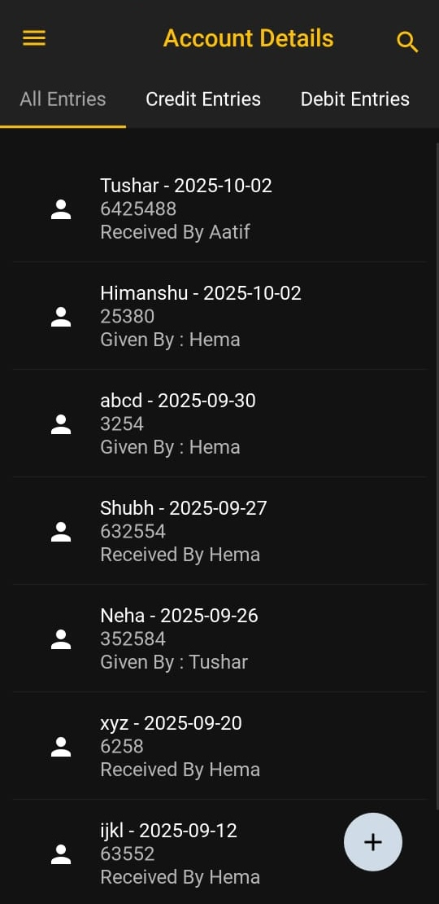
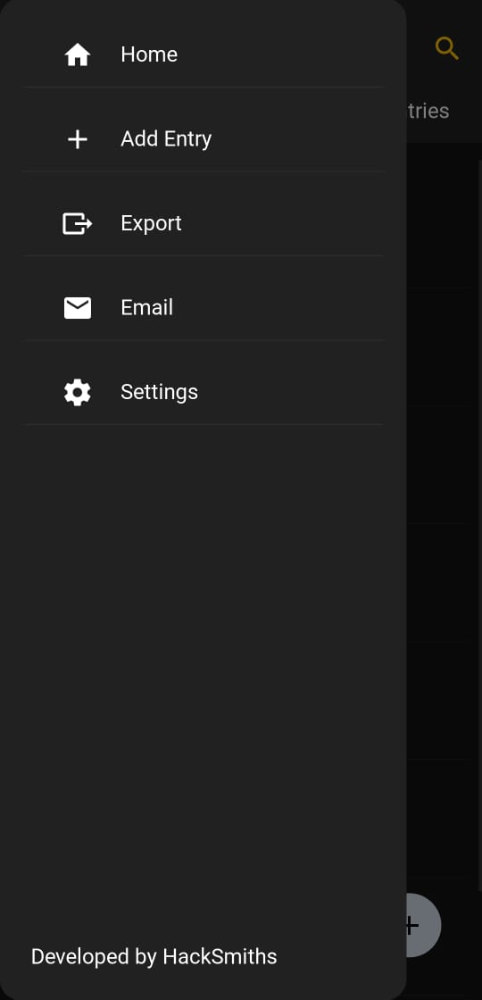
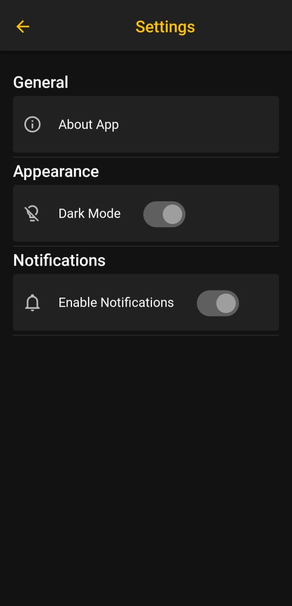
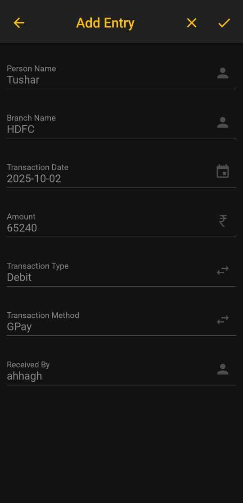
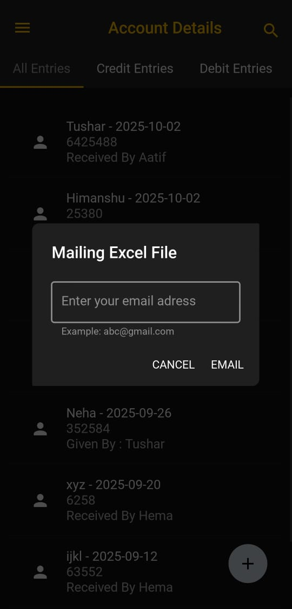

# Finora – Smart Account Management

**Finora** is a modern **account management app** built for simplicity, security, and speed.  
Whether it’s personal records or financial data, Finora helps you **store, organize, and export your accounts** effortlessly — all while keeping your data private and offline.

---

## 🌟 Why Finora?
- 🔐 **Your data stays with you** – no cloud, no leaks, fully offline.  
- 📊 **Export with ease** – generate clean **XLSX reports** in seconds.  
- 📱 **Made for Android** – smooth UI built with **KivyMD**, tailored for mobile.  
- ⚡ **Fast & reliable** – optimized workflows for day-to-day account tracking.  

---

## 🛠️ Tech Stack
- **Python 3**  
- **Kivy / KivyMD** – UI framework  
- **Pyjnius** – Android native APIs  
- **XlsxWriter** – XLSX export  
- **SAF (Storage Access Framework)** – secure Android file handling  

---

## 🚀 Roadmap
- ✅ Offline account management  
- ✅ XLSX export support  
- ⏳ Encrypted storage (coming soon)  
- ⏳ Import/export in CSV & JSON  
- ⏳ Cloud sync option (Google Drive / Dropbox)  

---

## 🎥 Demo Video

<video src="https://github.com/tushar6076/Finora/demo.mp4" controls width="600"></video>

---

## 📸 Screenshots

| Home Page | Navigation Drawer | Settings |
|-----------|-----------------|---------|
|  |  |  |

| Add Entry | Export Dialog |
|-----------|---------------|
|  |  |

---

## 🤝 Contributing
Contributions, issues, and feature requests are welcome!  
Feel free to open a PR or raise an issue.  

---

## 📄 License
This project is licensed under the **MIT License** – see [LICENSE](LICENSE) for details.  

---

💡 *Finora makes account handling **simple, private, and reliable** — the way it should be.*
